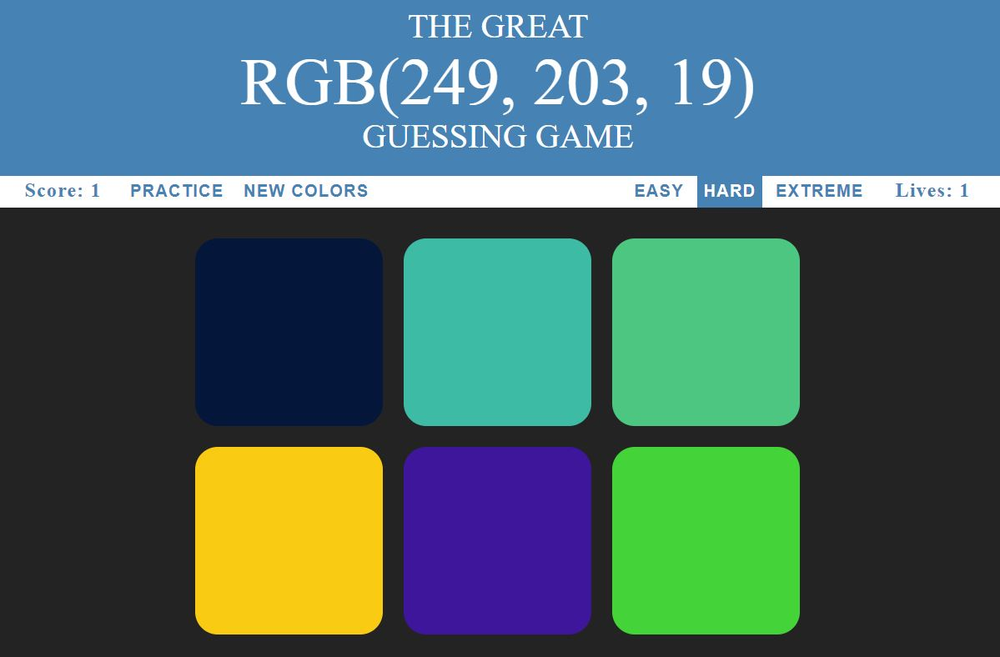

# RGBGuessingGame
>A Mini-game devloped with an objective of finding the colour matching to the random RGB values generated.

---

### Table Of Contents
- [Play](#play)
- [Description](#description)
- [Instructions](#instructions)
- [License](#license)
- [Author Info](#author-info)

---

## Play
[Click to Play The Game](https://gursimar04.github.io/RGBGuessingGame/)

---

## Description
Every programmer frequently uses RGB values to add colours to their prjects, but heavily depend on colour pickers. This mini-game put's ones RGB abilities to the test by challenging them at three difficulty levels and asking them to select the correct color in accordance with the RGB value. 

### Technologies

- HTML5
- CSS
- JavaScript

---

## Instructions
An RGB value can be found in the title. The objective is to select the alternative which has the same colour as the RGB value.

### Levels

- **Easy** The user has to choose from 3 alternatives, 2 of which are completely random.
- **Hard**- The user has to choose from 6 alternatives, 5 of which are completely random.
- **Extreme**- The user has to choose from 6 alternatives. The R, G ,and B values of the incorrect alternatives are in very close to the correct option.(-50 to -20 and +20 to +50)

---
## License
MIT License

Copyright (c) 2020 Gursimar Singh Bedi

Permission is hereby granted, free of charge, to any person obtaining a copy of this software and associated documentation files (the "Software"), to deal in the Software without restriction, including without limitation the rights to use, copy, modify, merge, publish, distribute, sublicense, and/or sell copies of the Software, and to permit persons to whom the Software is furnished to do so, subject to the following conditions:

The above copyright notice and this permission notice shall be included in all copies or substantial portions of the Software.

THE SOFTWARE IS PROVIDED "AS IS", WITHOUT WARRANTY OF ANY KIND, EXPRESS OR IMPLIED, INCLUDING BUT NOT LIMITED TO THE WARRANTIES OF MERCHANTABILITY, FITNESS FOR A PARTICULAR PURPOSE AND NONINFRINGEMENT. IN NO EVENT SHALL THE AUTHORS OR COPYRIGHT HOLDERS BE LIABLE FOR ANY CLAIM, DAMAGES OR OTHER LIABILITY, WHETHER IN AN ACTION OF CONTRACT, TORT OR OTHERWISE, ARISING FROM, OUT OF OR IN CONNECTION WITH THE SOFTWARE OR THE USE OR OTHER DEALINGS IN THE SOFTWARE.

---

## Author Info
- Linkedin - [Gursimar Singh Bedi](https://www.linkedin.com/in/gursimar-singh-bedi-31439a170)

[Back to the top](#RGBGuessingGame)
